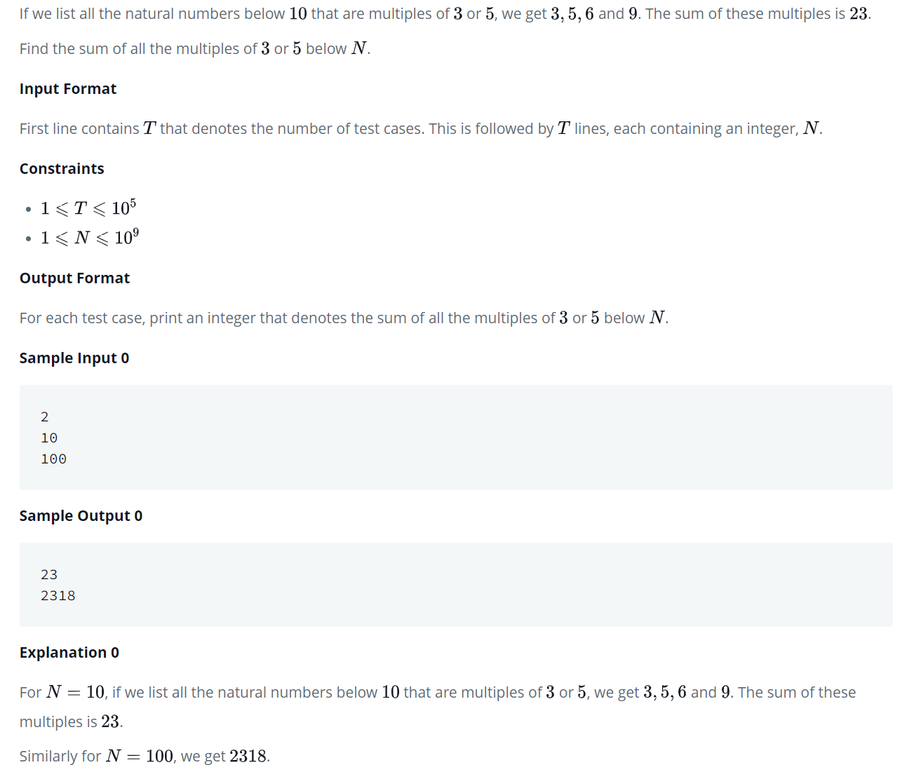

# Multiples of 3 and 5

## Problem
**TL;DR** Print the sum of all multiples of 3 and 5 up to number **_n_**

## My Solution
**TL;DR** Add multiples of 3, add all multiples of 5, **_subtract all multiples of 15_**

**"Visual"** 
Multiples of 3 include 3, 6, 9, 12, **15**...
Multiples of 5 include 5, 10, **15**...

**Explanation**
3 and 5 share a common multiple: 15. This means summing all multiples of 3 and all multiples of 5 will _double count_ multiples of 15. Therefore, we must subtract all multiples of 15.

